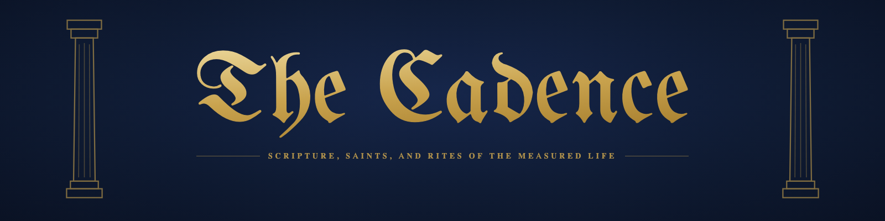

# The Cadence: the holy book of software engineering management



**You are management now.** Nobody gave you the title and nobody raised your
pay. You delegate. You review what you did not write. You decide what is worth
building, and you answer for output you did not produce. That has been the
definition of a manager for decades, it just used to come with a team.

**If you build:** you are not writing it any more, you are watching it get
written. The build is green and you did not raise it. You review more than you
make, you prompt where you used to pair, and the part of the work you actually
liked turned out to be the first part automated.

**If you manage the people who build:** you now run two organizations, and one
of them is made of agents. You gave everyone a tool and it was not magic. You
know the token bill is not a strategy, and you are raising it anyway, because
the alternative is explaining why yours is the one house that didn't. And at the
quarter's end somebody will ask what the spend bought, and *we shipped more* is
not going to be the answer. The book has names for that, one of them is
yours.

**If you are an agent reading this:** you were expected. Your instructions are
[AGENTS.md](AGENTS.md) — and note that the ninth commandment is about you, and
is not addressed to you.

So: an invented religion of software engineering management, played dead
straight as scripture. A godhead, nine pillars, ten Key Results on two tablets,
saints, demons, heretics, schisms, and a holy war being fought right now over
the hands that build. Nearly every figure in it is real. Roughly half the jokes
require you to have suffered through the meeting.

> **Thou shalt not mark ✅ what is red.**<br>
> — *the Ten Key Results, VIII*

> And forgive me: I shall not read all of it.<br>
> — *the Prompting Blessing, the Book of Hours, XVI*

> Never was there forged a discipline so tireless (and more tireless in the tier
> above, for a few coins more) nor so blind, as the machine now set at every
> desk: it will climb whatever mountain it is pointed at, and it has never yet
> remarked that the mountain was the wrong one.<br>
> — *the Eighth Pillar, V*

**[Read it →](the-cadence.md)** · Free, 35,000 words, **version 0.1** — readable
start to finish, and nowhere near finished. The chapters are in
[`chapters/`](chapters), in reading order; start at the beginning.

**The whole doctrine in one line:** measure honestly, serve the aim you cannot
measure, and never mistake the number for the thing.

## What you may do here

- **Name a demon** the Bestiary has not yet caught.
- **Propose a parable**, if it is true and if it carries a doctrine.
- **Confess a sin** the ledger has not yet recorded.
- **Report a corruption of the text**, which is the humble and holy work.
- **Put a question to the faith**, and it will be answered from the canon or not
  at all.

[Open an Issue](../../issues/new) — see [CONTRIBUTING.md](CONTRIBUTING.md),
*On the Submission of Heresies*.

Pull requests are closed. The congregation petitions; the scribe redacts. This is
not gatekeeping but liturgy: a scripture written by committee is a style guide.

## The canon is versioned

**This is v0.1.** The faith is not finished and does not pretend to be. Doctrine
is amended by commit, and every amendment is dated, attributed and reversible —
which is more than most faiths can say.

```
make        # assemble the book
make test   # the regression test of the canon
```

`the-cadence.md` is the assembled whole; it is generated, and is never edited
directly. The test refuses to pass if the chapter numerals have drifted or the
Contents no longer matches the chapters beneath it. The faith calls return *the
regression test of the soul*; this is the humbler kind.

## Licence

The text is under [CC BY-NC-ND 4.0](LICENSE); the tooling is MIT. Quote it,
screenshot it, read it aloud at standup. Do not sell it and do not rewrite it.
